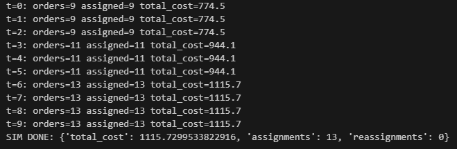

# Decentralized Auction-Based Multi-Depot Delivery Scheduling

## 📌 Overview
This project implements a **decentralized auction-based multi-depot delivery scheduling system** with:  
- **Local and shared vehicle coordination** to optimize order assignments.  
- **Dynamic order injection** for real-time rescheduling.  
- **Auction-based assignment** to minimize travel cost and ensure fairness.  

This approach allows flexible, scalable, and efficient delivery scheduling for multi-depot logistics operations.

## 🎯 Objectives
- Efficiently allocate vehicles to orders using **auction-based decision-making**.  
- Maintain **balanced usage** of local depot and shared vehicles.  
- Handle **new incoming orders dynamically** during operation.  
- Minimize **total delivery cost** while keeping all vehicles active.  

## 🛠️ Methodology
1. Define depots, vehicles, and initial orders with coordinates.  
2. Calculate **route costs** using Euclidean distances.  
3. Implement **local scheduling** at each depot with greedy assignment.  
4. Run **auction mechanism** to select lowest-cost proposals for each order.  
5. Inject new orders at specific time steps and reschedule dynamically.  
6. Track metrics for total cost, assignments, and reassignments.  

## 📊 Key Results
- Generated **balanced order assignments** using both local and shared vehicles.  
- Reduced overall travel costs while maintaining depot boundaries.  
- Demonstrated **dynamic rescheduling** with new incoming orders.  
- Provided a clear framework for **testing decentralized logistics strategies**.  

## 📷 Example Output

